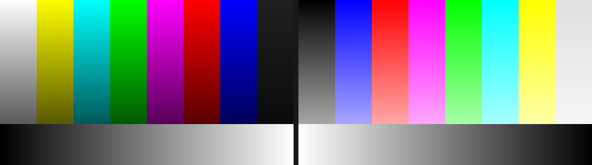
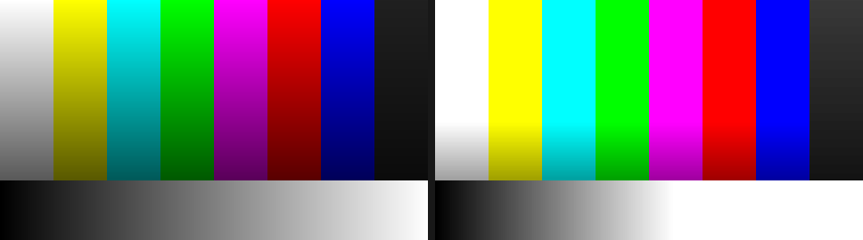

# resolume-ofx-bridge

> **AI-assisted project.** This codebase was created with [Claude](https://claude.com/claude-code)
> (Anthropic), directed and reviewed by a human author. The OFX host, parameter
> mapping and pixel path are verified against real OFX plugins by automated
> harnesses in this repo — including a headless OpenGL test that drives a
> generated plugin exactly as a host would (see [docs/03-verification.md](docs/03-verification.md)).
> It has **not** been loaded into Resolume itself, and has never been used on a
> live show. Treat it as a working prototype, not production tooling.

Run **OpenFX plugins** — the format DaVinci Resolve uses — inside **Resolume
Arena/Avenue** as native FFGL effects.

A standalone generator scans your OFX plugin folders and emits one FFGL bundle
per plugin, each exposing that plugin's real parameters, with their real names,
units, ranges and groupings, in Resolume's own UI.

## What it looks like

Real output from the OpenFX `Invert` example, rendered through the generated FFGL
plugin in an OpenGL context — before on the left, after on the right:



The same for the `Gain` example at `scale = 1.8`. Note the grey wedge along the
bottom clipping to white about halfway across, which is what a 1.8× gain should
do:



And the same again from a plugin rendering entirely on the **GPU with Metal** —
pixel-equivalent to the CPU result, at 5.4× the speed:


Neither image is a mock-up; both are written by
[`ffgltest --demo`](docs/03-verification.md) straight out of the plugin's
framebuffer.

## Why one bundle per plugin, not a dropdown

The obvious design is a single "OFX Host" effect with a dropdown listing your
installed plugins. FFGL can't express that.

FFGL 2.2 *can* change a parameter's display name, visibility and dropdown
elements at runtime. But its header explicitly lists range and default-value
change events as **not supported**, and a parameter's *type* is fixed when the
plugin loads. A dropdown wrapper would therefore have to declare a fixed pool of
pre-typed 0–1 sliders and rename them — every parameter losing its real units,
and any plugin with more parameters of a type than the pool has slots being
unrepresentable.

Generating one bundle per plugin keeps each parameter exactly as its author
declared it. See [docs/01-architecture.md](docs/01-architecture.md).

**You do not need a compiler.** Each generated bundle is a copy of one prebuilt
binary plus a JSON manifest, which the plugin reads when the host loads it.

## Install

Download the release for your platform, unzip, and run the generator:

```bash
./ofxgen generate --out ~/Documents/Resolume\ Arena/Extra\ Effects
```

That scans the conventional OFX locations for your platform (plus anything on
`OFX_PLUGIN_PATH`) and writes one FFGL bundle per usable plugin. Add `--dir` to
scan somewhere else:

```bash
./ofxgen generate --dir /path/to/my/plugins --out ~/Documents/Resolume\ Arena/Extra\ Effects
```

Then rescan effects in Resolume.

macOS builds are unsigned, and a quarantined plugin makes Resolume skip it rather
than prompt. Clear the flag after copying:

```bash
xattr -dr com.apple.quarantine ~/Documents/Resolume\ Arena/Extra\ Effects
```

## Building from source

```bash
git clone --recursive https://github.com/stoatworks-labs/resolume-ofx-bridge
cd resolume-ofx-bridge
cmake -S . -B build && cmake --build build -j8
```

## Trying it without any OFX plugins

There is probably no OFX plugin on your machine even if you have Resolve —
Resolve compiles its own ResolveFX into the application rather than installing
loadable bundles, so `/Library/OFX/Plugins` is usually empty. Build a test corpus
from the OpenFX examples:

```bash
./scripts/build-test-plugins.sh
```

Inspect what they contain:

```bash
./build/ofxprobe --dir build/test-plugins
```

```
uk.co.thefoundry.BasicGainPlugin
  label      : OFX Gain Example
  contexts   : OfxImageEffectContextFilter OfxImageEffectContextGeneral
  parameters : 8
    scale                    OfxParamTypeDouble     scale  (0..100)
    scaleComponents          OfxParamTypeBoolean    Scale Individual Components
    componentScales          OfxParamTypeGroup      Components
    scaleR                   OfxParamTypeDouble     red  (0..100)
    ...
```

Generate FFGL bundles from them, and check one loads correctly:

```bash
./build/ofxgen generate --dir build/test-plugins --out build/generated
./build/ofxgen verify build/generated/OFX_Gain_Example.bundle
```

```
unique ID : TMvU
name      : OFX Gain Example
type      : effect
parameters: 6
  scale                        standard  default=1        range=0..100
  scaleComponents              boolean   default=0        range=0..1
  scaleR                       standard  default=1        range=0..100  group=Components
  scaleG                       standard  default=1        range=0..100  group=Components
  scaleB                       standard  default=1        range=0..100  group=Components
  scaleA                       standard  default=1        range=0..100  group=Components
```

Eight OFX parameters become six FFGL ones: the group and page carry no value of
their own, the group instead becomes a heading on its children, and the 0–100
ranges survive intact.

## Tools

| | |
|---|---|
| `ofxgen generate` | scan for OFX plugins and write FFGL bundles |
| `ofxgen list` | show what was found, and why anything was skipped |
| `ofxgen verify` | load a generated bundle as a host would and print what it advertises |
| `ofxprobe` | dump a plugin's parameters; `--render` pushes a frame through it on the CPU |
| `ffgltest` | drive a generated bundle through a real OpenGL context; `--bench` to time it |

## Compatibility and limits

- **Only the Filter context** is hosted, since that is what maps onto an effect
  slot in a Resolume clip. Generator, Transition and General-only plugins are
  reported and skipped.
- **GPU rendering via Metal or OpenGL; CPU otherwise.** A plugin advertising OFX
  *Metal render* — what Resolve-targeted plugins on macOS use — renders on the
  GPU with no CPU round trip, **5.4× faster at 1080p** and 3.6× at 4K. OFX
  *OpenGL render* is supported too. Everything else takes the CPU path, a full
  GPU → CPU → GPU trip per frame. See
  [docs/04-gpu-acceleration.md](docs/04-gpu-acceleration.md).
- **CUDA and OpenCL are not implemented**, so GPU-only plugins that use those
  (Resolve on Windows and Linux) will not run. macOS Metal plugins will.
- **OpenGL-render plugins must use core-profile GL** to work in Resolume.
  Immediate-mode drawing is illegal in a core profile and macOS has no
  compatibility profile above 2.1.
- **Licensed plugins will mostly refuse to load.** The bridge identifies itself
  honestly as its own host, and many commercial OFX plugins only license
  themselves to hosts they recognise. That is the vendor's decision and is not
  worked around here.
- **Parametric (curve) parameters are declined** — FFGL has no equivalent and any
  flattening would misrepresent the plugin's UI.

## Documentation

- [docs/01-architecture.md](docs/01-architecture.md) — why a generator, and how a
  copied binary knows which plugin it is
- [docs/02-parameter-mapping.md](docs/02-parameter-mapping.md) — how each OFX
  parameter type becomes FFGL parameters
- [docs/03-verification.md](docs/03-verification.md) — what is actually tested,
  and what is not
- [docs/04-gpu-acceleration.md](docs/04-gpu-acceleration.md) — where a frame
  actually goes, and which GPU paths exist
- [AGENTS.md](AGENTS.md) — onboarding, invariants and the traps found along the way

## Licence

MIT — see [LICENSE](LICENSE).

Bundles [OpenFX](https://github.com/AcademySoftwareFoundation/openfx)
(BSD-3-Clause) and the [Resolume FFGL SDK](https://github.com/resolume/ffgl) as
submodules; each retains its own licence.
