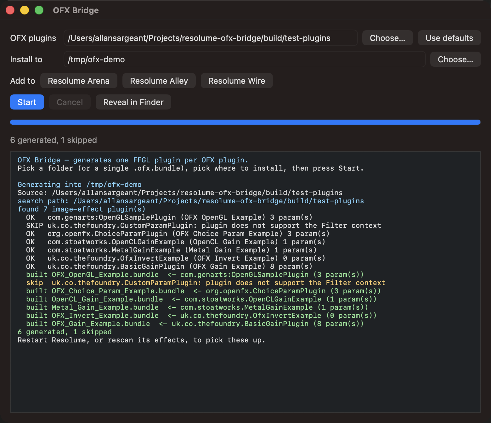

# Resolume OFX Bridge user guide

OFX Bridge **runs OpenFX plugins — the format DaVinci Resolve uses — inside Resolume, as native
FFGL effects**. You point it at a folder of `.ofx.bundle` plugins and it writes one FFGL bundle
per plugin into Resolume's effects folder.

**You do not need a compiler.** Each generated bundle is a copy of one prebuilt binary plus a
JSON manifest that it reads when the host loads it.

> **Before you rely on this:** released at v0.5.1 as a working prototype. The host, the parameter
> mapping and the pixel path are verified against real OFX plugins by automated harnesses,
> including a headless OpenGL test that drives a generated bundle exactly as a host would — and
> generated bundles **have since been run inside Resolume itself on real content**.
>
> The release ships a **macOS universal build only**; the Windows and Linux code paths exist but
> **have never been compiled**. The **CUDA path is written from the specification and has never
> been compiled or run**. And **licensed commercial plugins will mostly refuse to load** — see
> [What won't work](#what-wont-work).

---

## Installing plugins

Download the release, unzip, and open **OFX Bridge.app**: choose a folder of OFX plugins (or a
single `.ofx.bundle`), choose where to install, press **Start**.



The **Add to** buttons fill in the destination for whichever Resolume products are installed.
Only Arena and Avenue are known to scan an `Extra Effects` folder — buttons appear for Alley and
Wire because that is where they *would* look if support arrives, and clicking one says so in the
log.

Then **rescan effects in Resolume**.

> The app clears macOS quarantine from what it writes, which matters more than it sounds: **a
> quarantined plugin makes Resolume skip it silently** rather than prompt. If plugins still fail
> to appear after being copied around by something else:
>
> ```bash
> xattr -dr com.apple.quarantine ~/Documents/Resolume\ Arena/Extra\ Effects
> ```

### From the command line

```bash
./ofxgen generate --out ~/Documents/Resolume\ Arena/Extra\ Effects
```

That scans the conventional OFX locations for your platform (plus anything on `OFX_PLUGIN_PATH`).
Add `--dir` to scan elsewhere, or `--bundle /path/to/one.ofx.bundle` for a single plugin.

---

## "I have Resolve, so I have OFX plugins" — probably not

**There is most likely no OFX plugin on your machine even if you have Resolve.** Resolve compiles
its own ResolveFX into the application rather than installing loadable bundles, so
`/Library/OFX/Plugins` is usually empty.

To try the bridge with nothing installed, build a corpus from the OpenFX examples:

```bash
./scripts/build-test-plugins.sh
./build/ofxgen generate --dir build/test-plugins --out build/generated
```


*Neither image is a mock-up; both are written straight out of the plugin's framebuffer.*

---

## Why one bundle per plugin, not a dropdown

The obvious design is a single "OFX Host" effect with a dropdown listing your plugins. **FFGL
cannot express that.**

FFGL 2.2 can change a parameter's display name, visibility and dropdown elements at runtime — but
its header explicitly lists **range and default-value changes as not supported**, and a
parameter's **type is fixed when the plugin loads**. A dropdown wrapper would have to declare a
fixed pool of pre-typed 0–1 sliders and rename them: every parameter would lose its real units,
and any plugin with more parameters of a type than the pool has slots would be unrepresentable.

Generating one bundle per plugin keeps each parameter exactly as its author declared it — a
0–100 range stays 0–100.

---

## Speed: which path your plugin takes

| The plugin advertises | What happens | Speed at 1080p |
|---|---|---|
| **OFX Metal render** | Renders on the GPU, no CPU round trip | **5.4× CPU** |
| **OFX OpenGL render** | GPU, supported | — |
| **OpenCL** | Implemented and verified | 4.2× CPU |
| **Anything else** | CPU path — a full GPU → CPU → GPU trip per frame | baseline |

Metal is what Resolve-targeted plugins on macOS use, and Metal wins when a plugin offers both
Metal and OpenCL.


---

## What won't work

- **Only the Filter context is hosted** — that is what maps onto an effect slot in a Resolume
  clip. Generator, Transition and General-only plugins are reported and skipped.
- **Licensed commercial plugins will mostly refuse to load.** The bridge identifies itself
  honestly as its own host, and many commercial OFX plugins only license themselves to hosts they
  recognise. **That is the vendor's decision and is deliberately not worked around here.**
- **CUDA plugins are declined cleanly.** The path is written but never compiled or run — it needs
  an NVIDIA GPU, which macOS has not supported since 10.13. The host does not advertise CUDA, so
  such plugins are refused rather than half-run.
- **OpenGL-render plugins must use core-profile GL.** Immediate-mode drawing is illegal in a core
  profile, and macOS has no compatibility profile above 2.1.
- **Parametric (curve) parameters are declined** — FFGL has no equivalent, and any flattening
  would misrepresent the plugin's UI.

---

## Working out why a plugin didn't appear

The tools exist for exactly this, and in this order:

```bash
./build/ofxgen list                      # what was found, and why anything was skipped
./build/ofxprobe --dir /path/to/plugins  # a plugin's contexts and parameters
./build/ofxgen verify <bundle>           # load a generated bundle as a host would
./build/ffgltest <bundle>                # drive it through a real OpenGL context
```

`ofxgen list` is the first stop: a plugin that is skipped says so, with a reason.

`ofxgen verify` shows what survived the mapping. For the Gain example, **eight OFX parameters
become six FFGL ones** — the group and page carry no value of their own, the group becomes a
heading on its children, and the 0–100 ranges survive intact.

---

## Troubleshooting

| Symptom | Cause |
|---|---|
| **No plugins found at all** | Very likely there are none installed — Resolve doesn't install loadable bundles. Build the test corpus. |
| **A plugin was skipped** | Run `ofxgen list` for the reason: wrong context, parametric parameters, or CUDA-only. |
| **Bundle generated but Resolume doesn't show it** | Quarantine, almost always — Resolume skips a quarantined plugin silently. Clear it, then rescan effects. |
| **A commercial plugin refuses to license** | Expected. It only licenses to hosts it recognises, and the bridge does not spoof one. |
| **Effect renders but is slow** | It is on the CPU path — a full GPU round trip per frame. Check whether it advertises Metal. |
| **OpenGL-render plugin draws nothing** | It probably uses immediate-mode GL, which a core profile forbids. |
| **Windows or Linux build** | Neither has ever been compiled. macOS only for now. |

---

## See also

- [01-architecture.md](01-architecture.md) — why a generator, and how a copied binary knows which
  plugin it is
- [02-parameter-mapping.md](02-parameter-mapping.md) — how each OFX parameter type becomes FFGL
  parameters
- [03-verification.md](03-verification.md) — **what is actually tested, and what is not**
- [04-gpu-acceleration.md](04-gpu-acceleration.md) — where a frame actually goes
- [README](../README.md) — the tool list and downloads
